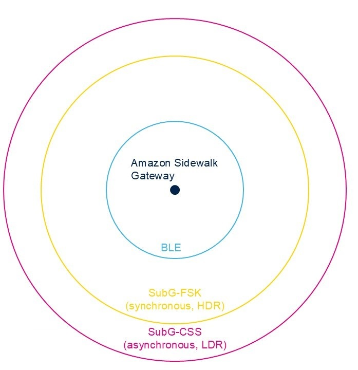
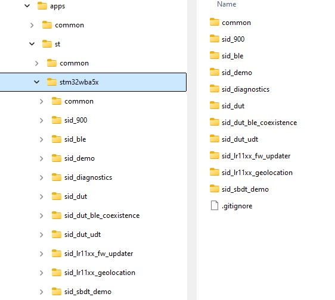
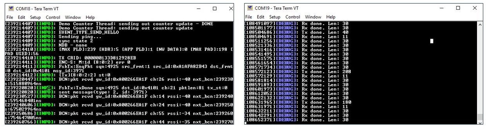

# Develop Amazon Sidewalk Application with STM32

**STMicroelectronics**

---

## Table of Contents

1. [Introduction](#introduction)
2. [ST Sidewalk SDK](#st-sidewalk-sdk)
3. [Provision a Sidewalk Device](#provision-a-sidewalk-device)
4. [Device(s) Setup](#devices-setup)
5. [Resources](#resources)

---
> [!NOTE]
> ## A middleware library is unavailable in this repository
> 
> In this repository, the middleware librariy listed below is **not available** as it is subject to some restrictive license terms requiring the user's approval via a "click thru" procedure.
> * `./pal/st/stm32wba/sid_pal/Middlewares/ST/STM32_Cryptographic`
> 
> It can be found inside the X-CUBE-CRYPTOLIB package available on our website `st.com` and downloadable from [here](https://www.st.com/en/embedded-software/x-cube-cryptolib.html#get-software). You will be prompted to login or to register in case you have no account.
---

## Introduction

---

### Amazon Sidewalk

Amazon Sidewalk provides seamless Wide Area Network coverage for Sidewalk devices, significantly extending IoT node access by utilizing Amazon Gateways. By standardizing on the Amazon Sidewalk protocol, it unlocks Amazon Echo gateways within the communication range of IoT devices, thereby enhancing connectivity and communication. This network facilitates asset tracking through multiple gateway access, which extends the reach and increases the reliability of the system.

Amazon leverages its existing devices, such as Echo and Ring, to create a wide area network that is free to use. This network is secure, with messages encrypted from end to end, ensuring data privacy and security. Amazon Sidewalk covers 90% of the American population, although it is currently only available in the US. It is perfectly suited for non-critical, low bandwidth applications, making it an ideal solution for a variety of IoT use cases.

Our Amazon Sidewalk SDK supports most of these different use cases, providing a versatile and robust platform for developers to build and deploy their IoT applications. This comprehensive support ensures that the Amazon Sidewalk network can be effectively utilized for a wide range of applications, enhancing the overall IoT ecosystem.

---

### Sidewalk Gateways

Most of the recent Amazon Echo and Amazon Ring devices come embedded with Amazon Sidewalk Gateway features. These features can be enabled or disabled through the user app. Importantly, these gateways never have access to the messages sent by the device; they simply forward messages from your end device to your AWS account.

Amazon Sidewalk Gateways support multiple communication protocols, including BLE (Bluetooth Low Energy), SubGHz-FSK (synchronous, HDR), and SubGHz-CSS (asynchronous, LDR). These gateways share a portion of the consumer’s internet bandwidth, with a maximum of 80Kbps, to provide connectivity to a group of Sidewalk-enabled devices.

<p align="center">
  
</p>

The Sidewalk network operates through three types of modulations:
- BLE (Bluetooth Low Energy): Requires a minimum of BLE 4.2, with no security feature, supporting 1M PHY and 2M PHY.
- SubGHz-FSK: A frequency-shift keying modulation.
- SubGHz-CSS (LoRa): A chirp spread spectrum modulation.

This shared bandwidth and multi-protocol support ensure that Sidewalk-enabled devices can maintain connectivity and communicate effectively within the network.

<p align="center">
  
</p>

---

### Amazon Sidewalk Coverage

Amazon Sidewalk provides extensive coverage, reaching 90% of the US population according to Amazon.

- [https://coverage.sidewalk.amazon/](https://coverage.sidewalk.amazon/)

<p align="center">
  
</p>

---

### Amazon Sidewalk End-devices

Amazon Sidewalk end-devices offer versatile connectivity options and seamless data transmission:

- They can use BLE or SubGHz-FSK for commissioning
- IoT data can be transmitted through Bluetooth LE, LoRa or SubGHz-FSK
- Sidewalk data is routed to AWS servers through the Amazon Gateways
- The data is then accessed and visualized through AWS servers
- When connected to your own Amazon Sidewalk Gateway (same account) your device has no data limitation.
- When your devices are in roaming mode (connected to other gateways). Monthly data used is capped at 500MB by customer (not device).

<p align="center">
  
</p>

---

### Amazon Sidewalk different use cases

| Use case        | Commissioning  | Communication | Device                 | Description                          |Project |
|-----------------|----------------|---------------|------------------------|--------------------------------------|--------|
| BLE Only        | BLE            | BLE           | STM32WBAxx             | Short range, suitable for high-throughput transfers (e.g., OTA image delivery) | sid_ble |
| FSK Only        | FSK            | FSK           | STM32WBAxx + S2-LP or STM32WBAxx + STM32WLx5 | Mid range, suitable for moderate-throughput transfers | sid_900 |
| BLE + CSS       | BLE            | BLE/CSS       | STM32WBAxx + STM32WLx5 | Best range compared to memory usage  | sid_900 |
| BLE + FSK       | BLE/FSK        | BLE/FSK       | STM32WBAxx + S2-LP or STM32WBAxx + STM32WLx5 | Mid range, adds BLE support for higher-throughput use cases (e.g., OTA) | sid_900 |
| BLE + FSK + CSS | BLE/FSK        | BLE/FSK/CSS   | STM32WBAxx + STM32WLx5 | Best range, more flexibility with Sidewalk functionality | sid_900 |

Alternatively, the Semtech SX126x or LR11xx transceivers can be used instead of the STM32WLx5 for FSK and CSS uses cases.

> [!NOTE]
> The FSK and CSS radio links cannot operate concurrently; however, applications may implement logic to dynamically switch between FSK and CSS modes based on runtime requirements.

<p align="center">
  
</p>


<p align="center">
  
</p>

---

### Third-Party Device Support

ST also offers support for multiple third-party devices from Semtech that integrate seamlessly with ST’s Sidewalk SDK libraries. These devices include the SX126x and the LR11xx, both of which are SubGHz radio transceivers designed to interface with Sidewalk services through supported Amazon devices.

The **SX126x** is a SubGHz radio transceiver that supports both LoRa and FSK communication protocols. This device is capable of interfacing with Sidewalk services, providing reliable and efficient data transmission for various IoT applications. Its support for multiple communication protocols ensures versatility and compatibility with a wide range of use cases.

The **LR11xx** is another SubGHz radio transceiver that supports LoRa and FSK communication protocols. In addition to its communication capabilities, the LR11xx integrates a GNSS scanner and a WiFi access point MAC address scanner. These additional features enable precise location tracking and enhanced connectivity options, making the LR11xx a powerful and versatile solution for IoT applications that require advanced functionality.

By supporting these third-party devices, STMicroelectronics expands the range of hardware options available to developers, allowing them to choose the best components for their specific application needs. This integration with Semtech devices ensures that developers can leverage the full potential of the Sidewalk SDK, creating robust and reliable IoT solutions.

<p align="center">
  
</p>

---

## ST Sidewalk SDK

---

### STMicroelectronics package for Sidewalk development

The Sidewalk SDK is an integration of the Sidewalk SDK v1.17.1.18 provided by Amazon, specifically designed to run on the STM32WBAxx MCUs. This package offers a comprehensive set of tools and services to facilitate the development of Amazon Sidewalk applications.

One of the key features of the SDK is the inclusion of examples, such as a Sidewalk communication app. This app demonstrates how to send a string using multiple different types of radio communication, providing developers with practical insights into implementing various communication protocols within their applications.

The Sidewalk Provisioning Services are another crucial component of the SDK. These services include an API for generating and storing AWS certifications inside the device, ensuring secure and authenticated communication. Additionally, the SDK provides certified radio services and configurations for Bluetooth Low Energy (BLE), Frequency-Shift Keying (FSK), and Long Range (LoRa) communication protocols, which are essential for reliable and efficient data transmission.

To support the development process, several qualified development boards are available as Sidewalk end-nodes. These include:
- **Nucleo-WBA55CG/Nucleo-WBA65RI + Nucleo-WL55CJ1**: This dual-MCU setup offers a robust platform for developing and testing Sidewalk applications, providing the capability to run user applications on both MCUs concurrently with the Sidewalk communication.
- **Nucleo-WBA55CG/Nucleo-WBA65RI + X-Nucleo-S2915A1**: This setup showcases a cost-efficient platform using ST's S2-LP transceiver (supports BLE and FSK Sidewalk links).
- **Nucleo-WBA55CG/Nucleo-WBA65RI + SX1262MB2CAS**: This configuration supports a popular SX126x transceiver family for FSK and CSS (LoRa) links.
- **Nucleo-WBA55CG/Nucleo-WBA65RI + LR1110MB1LCKS**: This combination is designed for the applications that utilize enhanced features of the LR11xx transceiver family, like nearby WiFi scanning and GNSS positioning.

Furthermore, STMicroelectronics provides support through their Territory Field Application Engineers (FAE). This ensures that developers have access to the necessary resources and assistance to successfully implement their Sidewalk applications, addressing any challenges that may arise during the development process.

---

### Tool prerequisites

- STM32CubeProgrammer v2.18.0+
- STM32CubeIDE v1.18.0+
- Serial Line Interface Software e.g. TeraTerm
- AWS Account

---
 
### Sidewalk SDK Prebuilt Libraries

The Sidewalk stack is provided as a collection of precompiled static libraries, each built with distinct configuration profiles tailored to specific use cases. The following stack variants are available:
- `sidewalk_sdk_basic` - regular Sidewalk stack with reduced feature set to achieve smaller flash & RAM footprints
- `sidewalk_sdk_full` - regular Sidewalk stack with all the features included and configurable in runtime
- `sidewalk_dut` - Amazon's proprietary application code for `sid_dut` application
- `sidewalk_sdk_qa` - special build of Sidewalk SDK specifically for the `sid_dut` app. Enables additional QA features that are not required in normal applications
- `sidewalk_halo_diagnostics` - Amazon's proprietary application code for `sid_diagnostics` application
- `sidewalk_sdk_diagnostics` - special build of Sidewalk SDK specifically for the `sid_diagnostics` app. Enables additional PHY-level diagnostic features that are not required in normal applications

> [!NOTE]
> The following features were excluded from the basic variant of the Sidewalk stack to minimize flash and RAM space consumption:
> - Autoconnect
> - Multilink mode
> - Sidewalk Bulk Data Transfer (SBDT)
>
> If your application requires any of the above features please use the full variant of the stack.

In addition, each stack variant is compiled with configurable radio link support, allowing end users to optimize flash and RAM usage by including only the radio interfaces required by their application. The following radio link configurations are available:
- `default` – Includes support for all three radio links: BLE, FSK, and CSS (LoRa)
- `ble` – Supports only the BLE radio link
- `ble_fsk` – Supports both BLE and FSK radio links
- `ble_lora` – Supports BLE and CSS (LoRa) radio links
- `fsk` – Supports only the FSK radio link
- `fsk_lora` – Supports both FSK and CSS (LoRa) radio links

The standard Sidewalk stack builds are optimized for minimal flash and RAM usage, and therefore exclude internal logging functionality within the libraries (note: application-level logging remains fully supported). For scenarios requiring diagnostic or debugging capabilities, alternative library variants with the `_with_logs` suffix are available. These variants are functionally identical to their corresponding standard builds, with the sole addition of internal logging. This added capability incurs a modest increase in flash footprint. For enhanced observability during Sidewalk SDK evaluation, the provided STM32CubeIDE reference projects are configured to use the logging-enabled variants by default.

Prebuilt SDK Libraries in the STM32CubeIDE to configure the STM32WBAxx device

<p align="center">
  

  
</p>

---

### Sidewalk Port over STM32WBAxx

The Sidewalk port over STM32WBAxx includes the `ble_adapter` for mapping Sidewalk proprietary APIs to the STMicroelectronics BLE stack and the `serial_bus` for mapping SPI communication drivers to the physical SPI transport driver and peripheral.

<p align="center">
  
</p>

---

### Sidewalk SDK applications

The Sidewalk SDK includes several applications designed to demonstrate and evaluate various aspects of the Sidewalk solution:

| Application | Scope/description |
|-------------|-------------------|
| sid_900 | Demonstrates connectivity between the end node and the AWS Sidewalk cloud by initializing the radio, synchronizing, registering and sending a string. - Multiple radio configurations (BLE-FSK, BLE-FSK, BLE-LoRa, FSK-LoRa, FSK-only) - Starting point for Sidewalk application development |
| sid_ble | A sample app similar to sid_900 but utilizing purely the BLE link. This app can run on a STM32WBAxx host without any external sub-GHz radio |
| sid_demo | End to end example of the bi-directional Sidewalk communication with Web UI. More information can be found [here](https://github.com/aws-samples/aws-iot-core-for-amazon-sidewalk-sample-app)|
| sid_diagnostics | Radio evaluation, test and verify radio using CLI commands to the STM32WBAxx device. Application also used in the manufacturing provisioning process |
| sid_dut | Sidewalk stack evaluation through CLI and Sidewalk APIs to test the Sidewalk solution. - Sidewalk API: radio init, connect, registration, reset - Send data over Sidewalk link |
| sid_dut_ble_coexistence | Extension to the sid_dut app showcasing the BLE co-existence operation (regular BLE running concurrently with the Sidewalk link). - CLI: creation of virtual device, sending peripheral data |
| sid_dut_udt | Extension to the sid_dut app to demonstrate the User Data Transfer (UDT) feature of the STM32WBAxx + STM32WLx5 platform - showcases how the SPI link between the two MCUs can be used to transfer user/application data in-between Sidewalk-related frames |
| sid_lr11xx_fw_updater | Utility app to simplify firmware updates of the LR11xx transceivers. While built on Sidewalk platform, it is not intended for the cloud communication |
| sid_lr11xx_geolocation | Showcases the usage of LR1110/LR1120 geolocation features together with the Sidewalk link |
| sid_sbdt_demo | Sidewalk Bulk Data Transfer demonstration - allows to download large files over BLE link |

<p align="center">
  
</p>

---

## Provision a Sidewalk Device

---

### Sidewalk Certification and Provisioning

To securely communicate with Sidewalk cloud services, the end node must have a signed certificate flashed to its memory. This ensures that the device can authenticate and securely transmit data within the Sidewalk network.

Sidewalk provisioning consists of two distinct flows: prototyping and mass production/manufacturing.

- **Prototyping Flow**: This flow is used for testing purposes and allows the user to provision devices one at a time. It is ideal for development and small-scale testing, enabling developers to ensure that their devices are correctly configured and functioning as expected.
- **Mass Production Flow**: This flow is designed for large-scale manufacturing and utilizes multiple factory tools to issue and register Sidewalk certificates to Sidewalk cloud services. It streamlines the provisioning process for mass production, ensuring that a large number of devices can be efficiently and securely provisioned for deployment.

By supporting both prototyping and mass production flows, the Sidewalk provisioning process accommodates the needs of developers during the initial testing phase as well as the requirements of manufacturers during large-scale production.

---

### Prototype Provisioning Process with STM32 Overview

For detailed instructions see the following sections.

1. Add device to AWS IoT Core for Amazon Sidewalk
2. Convert Provisioned Device’s Certificate from .json to .hex
3. Flash the .hex file to the STM32WBA device

**Pre-requisites:**
- AWS account
- STM32Cube-Programmer
- STM32WBAxx Nucleo Boards


<p align="center">
  
</p>

---

### Login to the AWS Account

To begin using the AWS services for your Sidewalk application, developers must first ensure that they have an AWS account set up. If you do not already have an account, you will need to create one by visiting the AWS website and following the registration process.

Once your AWS account is set up, you can log in as the Root user. This requires using the email address and password that you chose during the account creation process. Logging in as the Root user provides you with full access to all AWS services and resources, allowing you to manage your Sidewalk application effectively.

- Developers must have an AWS account set-up.
- Login as Root user using the email address and password chosen

<p align="center">
  
</p>

---

### Select the US East region – North Virginia

- Once logged in to the AWS Account, make sure that the US East region is selected from the top right corner, displaying “N. Virginia”

<p align="center">
  
</p>

---

### Setting up your IoT Core Services

To set up your IoT Core services, follow these steps to configure the necessary profiles and destinations for your Sidewalk devices.

1. Search for “iot core” in the search bar on the top left
2. Click on “IoT Core”

<p align="center">
  
</p>

---

### Add LPWAN Profile 1/3

Create a new LPWAN profile to define the communication parameters for your Sidewalk devices.

1. In the left menu, select “LPWAN devices”
2. Then click on “Profiles”

<p align="center">
  
</p>

---

### Add LPWAN Profile 2/3

Select the Sidewalk protocol and add a new device profile.

1. Select “Sidewalk”
2. On the top-right, click “Add device profile”

<p align="center">
  
</p>

---

### Add LPWAN Profile 3/3

Name your profile and submit the configuration.

1. Choose a profile name
2. Click “Submit”

<p align="center">
  
</p>

---

### Add LPWAN Destination 1/2

Create a destination to route messages from your Sidewalk devices to AWS IoT Core.

1. Click “Destinations”
2. On the top-right, click “Add destination”

<p align="center">
  
</p>

---

### Add LPWAN Destination 2/2

Configure the destination settings to publish messages to the AWS IoT Core message broker.

1. Choose a Destination name
2. Select “Publish to AWS IoT Core message broker”
3. Specify a topic name, e.g., “sidewalkTopic”
4. Click “Add destination”

<p align="center">
  
</p>

---

### Provision a Sidewalk Device 1/4

Provision your Sidewalk device by following these steps to register it with AWS IoT Core.

1. In the left menu, select “LPWAN devices”
2. Then click on “Devices”
3. Select “Sidewalk” from the top menu
4. And then click on “Provision device”

<p align="center">
  
</p>

---

### Provision a Sidewalk Device 2/4

Enter the device details and select the previously created profile and destination.

1. Choose a Device name, e.g., Test_Sidewalk_Device
2. Specify a Description, e.g., ST Sidewalk Demo
3. Select the Profile previously created
4. Select the Destination previously created
5. Click “Next”

<p align="center">
  
</p>

---

### Provision a Sidewalk Device 3/4

Enable Thing Registration and specify a Thing name.

1. Enable the option “Thing Registration”
2. Choose a Thing name, e.g., Test_Thing
3. Click “Next”

<p align="center">
  
</p>

---

### Provision a Sidewalk Device 4/4

Review the information and create the device.

1. Review the information
2. Click “Create”

<p align="center">
  
</p>

---

### Congratulation! Your Sidewalk Device is provisioned

Download the device’s certificate in JSON format for further use.

1. You should get the confirmation message that the device has been successfully provisioned with a specified device ID
2. Click “Download device JSON file” to save the device’s certificate in JSON format

<p align="center">
  
</p>

---

### Convert your Device’s Certificate

Convert the device’s certificate from JSON to HEX format for flashing onto the device using the supplied Python tool.

1. Put your certificate JSON file into the `./tools/provision` folder
2. Open a command line window in the `./tools/provision` folder
3. If this is the first time you run the script, install Python dependencies first with `pip install -r requirements.txt` (note: depending on the host operating system and installed Python package, the specific command may differ slightly, e.g. `pip3 install -r requirements.txt`)
4. Use the following command to generate the hex file: `python provision.py st aws --chip <target chip name> --certificate_json <your certificate JSON file>`, e.g. `python provision.py st aws --chip WBA55xG --certificate_json certificate.json`.
5. The script will generate `.bin` and `.hex` credentials file suitable for flashing into the STM32WBA MCU. The default option is to use the `.hex` file for flashing because it contains flashing address information. The `.bin` file is a raw content without any address information, it can be useful if you modify the flash layout in your project, making the data in the produced `.hex` file mispositioned

Usage example and expected output:
```
$ python provision.py st aws --chip WBA65xI --certificate_json certificate_wba6.json
deviceTypeId found in certificate_wba6.json
Using chip config : (WBA65xI:STM32WBA65xI address: 0x81ea000)
Generated /sidewalk/tools/provision/st_aws_WBA65xI.bin
Generated /sidewalk/tools/provision/st_aws_WBA65xI.hex
```

More information on the usage of the Python script can be found in the [script's Readme file](./tools/provision/readme.md)

---

## Device(s) Setup

---

### STM32WBAxx AND STM32WL55 HW Configuration

- 1x NUCLEO-WBA55CG or NUCLEO-WBA65RI board
- 1x NUCLEO-WL55JC1 board
- Boards interconnected via Arduino Uno V3 headers or DuPont wires:
  - SPI BUS: SPI1_SCK, SPI1_MISO, SPI1_MOSI, SPI1_NSS
  - RADIO_IRQ
  - VCC and GND
- Power: USB connection to NUCLEO-WBA55CG/NUCLEO-WBA65RI and NUCLEO-WL55JC1

<p align="center">
  
</p>

---

### STM32WBAxx and STM32WL55 connection

- When using the Arduino Uno V3 headers (default connection method), the following pin mapping applies

| Signal    | NUCLEO-WL55JC1       | NUCLEO-WBAxx         |
|-----------|----------------------|----------------------|
| NSS       | CN5.3 (D10)          | CN6.3 (D10)          |
| MOSI      | CN5.4 (D11)          | CN6.4 (D11)          |
| MISO      | CN5.5 (D12)          | CN6.5 (D12)          |
| SCK       | CN5.6 (D13)          | CN6.6 (D13)**        |
| RADIO_IRQ | CN5.1 (D8)           | CN6.1 (D8)           |
| GND       | Default Arduino pins | Default Arduino pins |
| Power     | Default Arduino pins | Default Arduino pins |

**\*\*Note: The GPIO pin to drive SCK line is shared with the blue LED (LD1) on the NUCLEO-WBA55CG board, causing the LED to glow slightly during SPI transactions. This does not affect SPI performance**

**Note: the reset lines of STM32WBA55 and STM32WL55 are coupled when using this connection scheme. Pressing the reset button on either of the Nucleo boards (or flashing either of them) will reset both MCUs. Software-initiated resets via NVIC are still independent because NRST pin is not driven when performing a software reset**

- There's an alternative jumper wire-based connection method that allows to free up the Arduino Uno V3 SPI pins on Nucleo-WL55JC1 board. Follow the connection diagram  below:

| Signal | NUCLEO-WL55JC1 | NUCLEO-WBA55CG/NUCLEO-WBA65RI |
|--------|-----------------|----------------|
| MOSI   | CN4.15          | CN7.32         |
| NSS    | CN4.17          | CN10.19        |
| MISO   | CN4.13          | CN10.11        |
| SCK    | CN4.11          | CN10.16        |
| RADIO_IRQ | CN3.34       | CN10.17        |
| GND    | CN3.19          | CN7.19         |
| **VCC** | CN2.18         | CN7.18         |

**Note: CubeIDE project configuration shall be adjusted to enable the above connection method. Navigate to the "C/C++ Build -> Settings -> Tool Settings -> MCU GCC Compiler -> Preprocessor" section in the project properties and change "SIDEWALK_RADIO_USE_ARD_CONN_STACKING=1" to "SIDEWALK_RADIO_USE_ARD_CONN_STACKING=0". This applies to both NUCLEO-WBA55CG/NUCLEO-WBA65RI and NUCLEO-WL55JC1 projects**

**Note: Long jumper wires may introduce noise on the signal lines, resulting in degraded SPI performance or false-positive IRQ indication**

<p align="center">
  
</p>


**Note: VCC interconnection is not recommended when individual USB connections are made to both devices.**

---

### STM32WBAxx AND S2-LP HW Configuration

- 1x NUCLEO-WBA55CG or NUCLEO-WBA65RI board
- 1x X-NUCLEO-S2915A1 board
- Boards stacked on Arduino connectors for connecting these signals:
  - SPI BUS: SPI1_SCK, SPI1_MISO, SPI1_MOSI, SPI1_NSS
  - RADIO_IRQ
  - VCC and GND
- Power: USB connection to NUCLEO-WBA55CG/NUCLEO-WBA65RI

<p align="center">
  
</p>

---

### STM32WBAxx and S2-LP connection

**Required HW Modifications for X-NUCLEO-S2915A1:**

X-NUCLEO-S2915A1 comes with an Arduino-style connector, however, some of the lines use non-standard (for Arduino) pins by default. HW configuration of the X-NUCLEO-S2915A1 incompatible with NUCLEO-WBA55CG/NUCLEO-WBA65RI. However, X-NUCLEO-S2915A1 is configurable with 0-Ohm jumper resistors. Two options:
1. Solder bridge reposition to make X-NUCLEO-S2915A1 layout Arduino-compatible - requires soldering of SMD0402 resistors
2. Use DuPont jumper wires to connect X-NUCLEO-S2915A1 and NUCLEO-WBA55CG/NUCLEO-WBA65RI - requires no soldering

**Solder Bridge Repositioning on X-NUCLEO-S2915A1 - resolder the jumper resistors as follows:**
- R10 → R18 (moves RESET signal to avoid GPIO conflicts with other evaluation board) - necessary
- R11 → R6 (moves SPI SCLK signal to the default Arduino position) - necessary
- R13 → R9 (moves SPI NSS signal to the default Arduino position) - necessary
- Add R17 - allows usage of red LED for visual indication - optional, everything works even without the LED. If using the LED, a jumper should be placed between pins 19 and 21 of the CN4 connector on the NUCLEO-WBAxx board

**DuPont Connection - use the following mapping:**

| Signal | X-NUCLEO-S2915A1 | NUCLEO-WBAxx |
|--------|-------------------|--------------|
| VDD 3V3 | CN6, pin 4       | CN5, pin 4   |
| GND     | CN6, pin 6       | CN5, pin 6   |
| GPIO0/RF Switch Ctrl 1 | CN8, pin 1 | CN7, pin 1 |
| SPI NSS | CN8, pin 2       | CN6, pin 3   |
| GPIO1/RF Switch Ctrl 2 | CN8, pin 3 | CN7, pin 3 |
| GPIO2/RF Switch Ctrl 3 | CN8, pin 4 | CN7, pin 4 |
| GPIO3/Radio IRQ | CN8, pin 6 | CN7, pin 6 |
| SPI MISO | CN5, pin 5      | CN6, pin 5   |
| SPI MOSI | CN5, pin 4      | CN6, pin 4   |
| SDN/Radio Reset | CN9, pin 8 | CN8, pin 8 |
| SPI SCLK | CN9, pin 4      | CN6, pin 6   |

---

### STM32WBAxx and Semtech Configuration

- NUCLEO-WBA55CG/NUCLEO-WBA65RI + SX1262MB2CAS
- NUCLEO-WBA55CG/NUCLEO-WBA65RI + LR1110MB1LCKS

- 1x NUCLEO-WBA55CG or NUCLEO-WBA65RI board
- 1x SX1262MB2CAS or LR1110MB1LCKS board
- Boards stacked on Arduino connectors for connecting these signals:
  - SPI BUS: SPI1_SCK, SPI1_MISO, SPI1_MOSI, SPI1_NSS
  - RADIO_IRQ
  - VCC and GND
- Power: USB connection to NUCLEO-WBA55CG/NUCLEO-WBA65RI

<p align="center">
  
</p>

---

### Sidewalk SDK Directory

- The project files for the BLE and SubGHz devices are found under the ble_mcu and subghz_mcu folders in the device specific folders (STM32WBAxx_STM32WL55)
- For the STM32WBAxx_S2-LP project, there are no subdirectories since there is only a singular MCU.
- For the STM32WBAxx_(Semtech) projects, there are no subdirectories since there is only a singular MCU.
- Select these folders to open the corresponding projects in CubeIDE

<p align="center">
  
</p>

---

### Application Build Configurations – WBAxx and WL

For the WBAxx + and WL55 configuration two projects are loaded into the STM32CubeIDE

The build configurations from the Sidewalk SDK prebuilt libraries for the WBAxx + WL55 are shown below

<p align="center">
  
</p>

---

### Application Build Configurations – WBAxx and S2-LP

For the WBAxx + S2-LP configuration only one project is loaded into the STM32CubeIDE

The build configurations from the Sidewalk SDK prebuilt libraries for the WBAxx + S2-LP are shown below

<p align="center">
  
</p>

---

### Application Build Configurations – WBAxx and Semtech

For the WBAxx + Semtech configuration, only one project is loaded into STM32CubeIDE. The build configurations from the precompiled Sidewalk SDK libraries for WBAxx + Semtech are shown below.

<p align="center">
  
</p>

---

### Flashing the WBA and WL Devices

In STM32CubeProgrammer, three files need to be flashed onto the WBAxx and WL55 devices, specifically two files for the WBAxx and one file for the WL55:

**WBAxx:**
1. Sidewalk certificate .hex file
2. Sidewalk_STM32WBAxx.hex

**WL55:**
1. Sidewalk_STM32WL55.hex

**For WBAxx:**
1. Connect to the device and perform a "full chip erase."
2. Disconnect and reconnect.
3. Deselect "Skip flash erase...", "Verify programming," and "Run after programming."
4. Select the Amazon Sidewalk certificate and program it.
5. Select "Skip flash erase...", "Verify programming," and "Run after programming."
6. Select the Sidewalk_STM32WBAxx.hex file and program it.

**For WL55:**
1. Connect to the device and perform a "full chip erase."
2. Disconnect and reconnect.
3. Select the Sidewalk_STM32WL55.hex file and program it.

<p align="center">
  
</p>

---

### Flashing the WBA Devices for WBA and S2-LP/SX126x/LR11xx combinations

In STM32CubeProgrammer, two files need to be flashed onto the WBAxx device:

1. Sidewalk certificate .hex file
2. Sidewalk_STM32WBAxx.hex

**To program the WBAxx, follow these steps:**
1. Connect to the device and perform a "full chip erase."
2. Disconnect and reconnect.
3. Deselect "Skip flash erase...", "Verify programming," and "Run after programming."
4. Select the Amazon Sidewalk certificate and program it.
5. Select "Skip flash erase...", "Verify programming," and "Run after programming."
6. Select the Sidewalk_STM32WBAxx.hex file and program it.

<p align="center">
  
</p>

---

### Serial Terminal Configuration

The serial terminal must be configured as follows to send commands and receive output from the NUCLEO-WBAxx board:
- Baud rate: 115200 bps
- Data: 8-bit
- Parity: None
- Stop bit: 1 bit
- Flow control: None

A serial terminal connected to the NUCLEO-WL55 can be opened with the same terminal settings.

---

### Verify the Device Functionality

Once the devices have been programmed and correctly connected, verify the functionality of the application using Tera Term. You should see the ST application name, the ST Sidewalk application version, the build type, and the Sidewalk SDK version.

**WBAxx and WL55 Terminal Output**

<p align="center">
  
</p>

---

### sid_900 Expected MQTT Display

The sid_900 application demonstrates the basic functionality of the Sidewalk stack by initializing the radio, provisioning, synchronizing, and sending a string synchronously every minute. Subscribe to all topics by typing "#" in the "Topic Filter" text box. When observing the MQTT test client in the AWS IoT dashboard, a packet should be received every minute after the application starts. An asynchronous string can be sent by pressing the button on the WBAxx.

<p align="center">
  
</p>

---

### Sid_900 Expected Serial Terminal Display

"Hello" ping sent by pressing button 1. Synchronous data transmission from the end node. WL55 terminal output showing synchronous transmissions and receptions from the Amazon device.

<p align="center">
  
</p>

---

## Resources

---

### Sidewalk Resources

- [Sidewalk Gateways](https://docs.sidewalk.amazon/introduction/sidewalk-gateways.html): list of the devices that can serve as a Sidewalk gateway.
- [Sidewalk Gateway Configuration](https://docs.sidewalk.amazon/getting-started/sidewalk-onboard-prereq-gateway.html): a guide to configure Sidewalk gateway (e.g., Echo) via Alexa app.
- [SID API](https://docs.sidewalk.amazon/sid-api-dg/): documentation of Sidewalk API on embedded devices.
- [Manufacturing Provisioning Process](https://docs.sidewalk.amazon/manufacturing/): Description of the provisioning process setup for mass production of Sidewalk end-node devices.
- [Specifications](https://docs.sidewalk.amazon/specifications/): Amazon Sidewalk protocol and test specifications.

---

© STMicroelectronics - All rights reserved.

The ST logo is a trademark or registered trademark of STMicroelectronics International NV or its affiliates in the EU and/or other countries. For more information on ST trademarks, refer to [www.st.com/trademarks](http://www.st.com/trademarks).

All other product or service names are the property of their respective owners.

Learn more at [www.st.com](http://www.st.com)